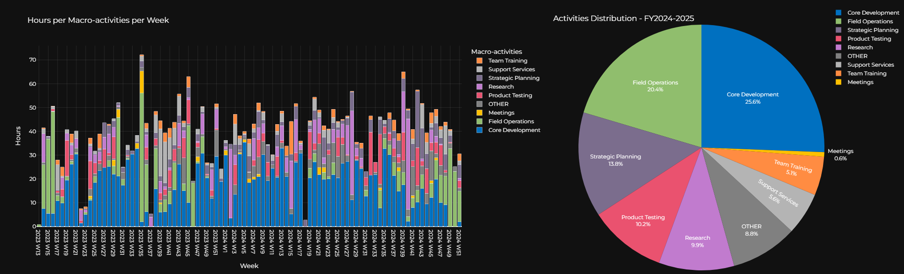

# Time-Tracker-Google-Calendar
Time-Tracker-Google-Calendar analyzes time usage by processing events from Google Calendar .ics files. It provides insights into activities time percentages and weekly distributions. Configurable files enable mapping, replacements, and customizations to generate metrics over user-defined periods.

## Output Examples

### Activities & Weekly Hours Distribution


## Features

- 📊 Visualize time allocation across different activities
- 📅 Analyze weekly work patterns
- ⚙️ Configurable activities categorization with macro and micro activities
- 🔄 Text replacement for consistency
- 📌 Holiday and vacation handling
- 📈 Custom time period analysis with fiscal year support
- 🎨 Customizable color schemes for visualizations

## Installation

1. Clone the repository:
```bash
git clone https://github.com/yourusername/calendarmetrics.git
cd calendarmetrics
```

2. Create a virtual environment (recommended):
```bash
python -m venv venv
source venv/bin activate  # On Windows: venv\Scripts\activate
```

3. Install dependencies:
```bash
pip install -r requirements.txt
```

## Usage

1. Export your Google Calendar to ICS format:
   - Go to Google Calendar Settings
   - Navigate to "Import & Export"
   - Click "Export" to download your calendar as ICS

2. Place the ICS file in the `input` directory as `calendar.ics`

3. Configure your settings (see Configuration section)

4. Run the analysis:
```bash
python main.py 
```

## Configuration

CalendarMetrics uses YAML configuration files located in the `config/` directory:

### 1. Events Grouping (`events_grouping.yaml`)

This file defines:
- Macro activities mappings with both macro variants and micro keywords
- Events to exclude from analysis
- Color schemes for visualizations

Example structure:
```yaml
macro_activities_mapping:
  DEVELOPMENT:
    macro_variants:
      - "DEV"
      - "DEVELOPMENT"
      - "CODING"
    micro_keywords:
      - "bug fix"
      - "feature"
      - "implementation"

  MEETINGS:
    macro_variants:
      - "MEET"
      - "MEETING"
      - "SYNC"
    micro_keywords:
      - "standup"
      - "planning"
      - "retrospective"

excluded_events:
  - "OOF"
  - "OUT OF OFFICE"
  - "VACATION"

macro_colors:
  DEVELOPMENT: '#4287f5'
  MEETINGS: '#f54242'
```

### 2. Text Replacements (`text_replacements.yaml`)

Define common typos or variations to be standardized:

```yaml
replacements:
  "meting": "meeting"
  "developement": "development"
  "synq": "sync"
```

### 3. Holidays and Vacations (`holidays.yaml`)

Specify dates to exclude from analysis by year:

```yaml
holidays:
  2024:
    - "2024-01-01"  # New Year's Day
    - "2024-12-25"  # Christmas

vacations:
  2024:
    - start: "2024-07-15"
      end: "2024-07-30"
      description: "Summer Break"
```

### 4. Time Periods (`time_periods.yaml`)

Define fiscal year settings and analysis date range:

```yaml
default_periods:
  quarter:
    start_month: 9  # September
    duration_months: 3
  year:
    start_month: 9  # September
    end_month: 8    # August next year

active_range:
  start_date: "2024-01-01"
  end_date: "2024-12-31"
```

## Calendar Event Format

Format your calendar events as follows:
```
MACRO_ACTIVITY | micro_activity_description
```

Examples:
- `DEVELOPMENT | Implementing authentication module`
- `MEETING | Sprint planning with team`
- `SUPPORT | Customer onboarding call`

The part before the `|` will be mapped to your macro activities using the rules in `events_grouping.yaml`, and the part after provides additional detail that can also influence the mapping through micro keywords.

## Output

The tool generates several visualizations in the `output` directory:

1. **Weekly Hours Chart**: 
   - Stacked bar chart showing hours per macro activity per week
   - Interactive HTML visualization
   - Saved as `weekly_hours.html`

2. **Calendar Quarter Distribution**:
   - Shows percentage of time spent on each macro activity per quarter
   - Interactive pie charts
   - Saved as `percentages_YYYY_QN.html`

3. **Fiscal Year Distribution**:
   - Shows percentage of time spent on each macro activity per fiscal year
   - Interactive pie charts
   - Saved as `percentages_FY_YYYY_YYYY.html`

4. **Raw Data**:
   - Excel file with all processed events
   - Saved as `processed_events.xlsx`

## Contributing

Contributions are welcome! Please feel free to submit a Pull Request.

## License

This project is licensed under the MIT License - see the LICENSE file for details.